# FS22_DK_edit_Goldhofer_StzVp3

## *The true lowloader experience*


This is the lowloader to use for smaller roads. It can carry a lot of equipment because it can be made wider and can be extended. With the steering axles yuou are able to turn in short corners.


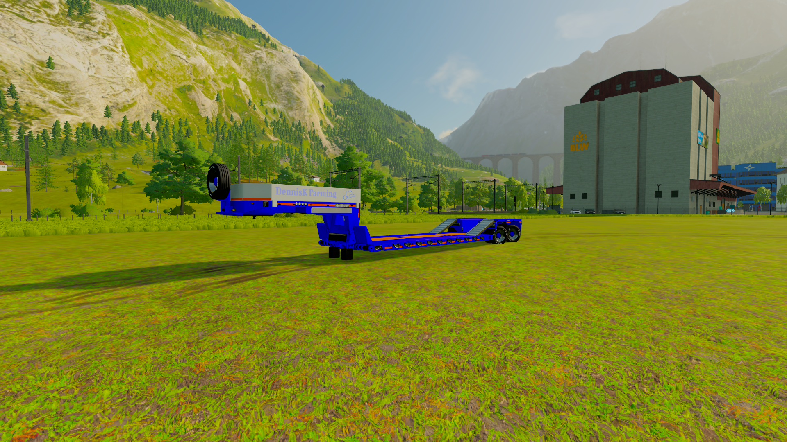

This is the 2 axle version.

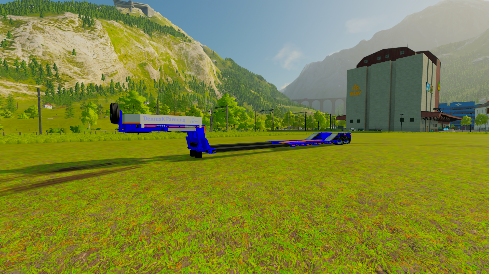

The 2 axle version extended.

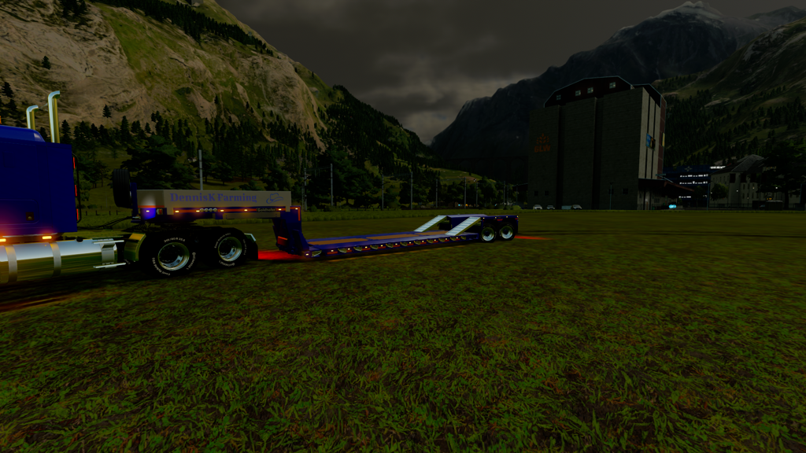

Perfect lights

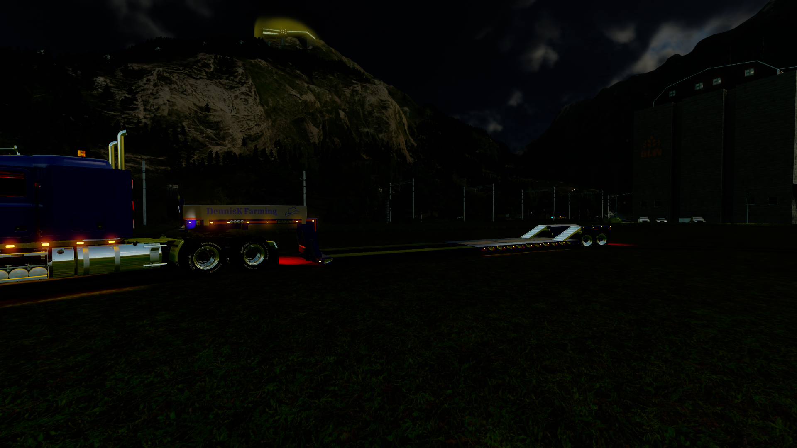

Perfect lights with reallights even when extended

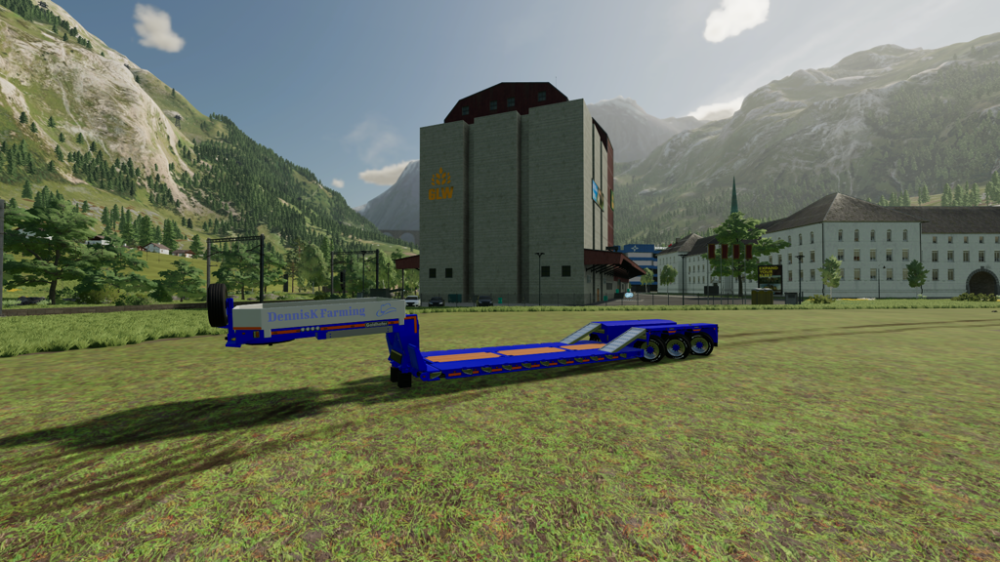

This is the 3 axle version.

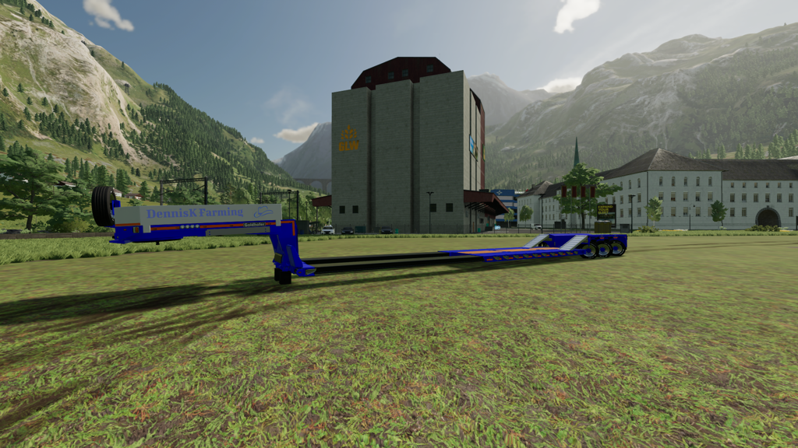

The 3 axle version extended.

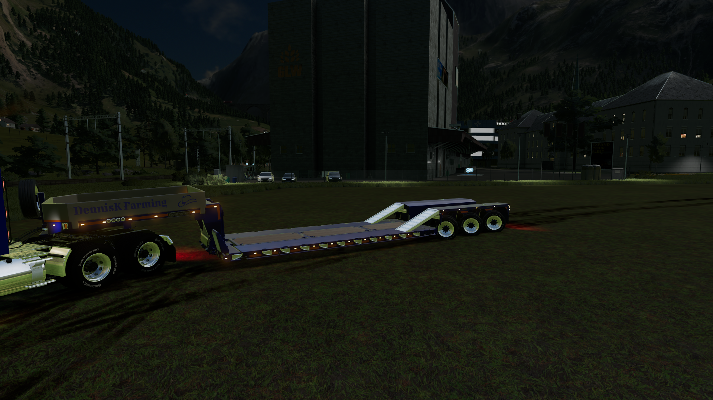

Perfect lights

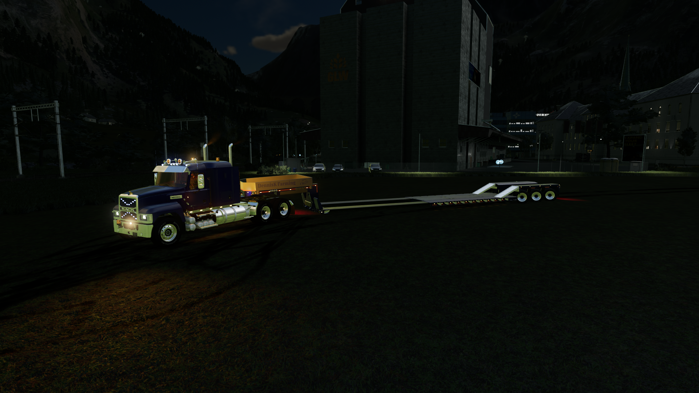

Perfect lights with reallights even when extended


```
Original author: HR Forst und Fahrzeugbau

Contributed by: DennisK

If you distribute this mod, always include this info.

AND DO NOT UPLOAD IT TO MONATERY UPLOAD SERVICES.
THIS MOD IS AVAILABLE TO ANYONE FOR FREE AND YOU CAN USE
IT AND EDIT IT ANYWAY YOU WANT FOR PERSONAL USE.
```


## New upload 2024-02-21 (release 2.1.0)

This is a new upload and is as good as done.

- Added sidemarker lights to front section.
- Added workinglights to front section.
- Added real lights to sidemarkers.
- Fixed blinker front section.
- Color select adjusted.
- Changed default color.
- Added logo to front section.
- Mod is now in a seperate category.
- Changed mod to DK edit because of "private" use.


## Note
Before downloading and using this mod always check the issues page. https://github.com/DennisKgaming/FS22_DK_edit_Goldhofer_StzVp3/issues

Sometimes issue are found and need to be solved first. Not all issues will give problems when using this mod.

## Multiplayer
Multiplayer is tested and supported.


## Guide / documentation

- Select front or rear part
    - Front part
        - Use X to slide out the markerplates
        - Use RMB up and down to lift or lower the trailer at the front
    - Rear part
        - Use X to slide out the markerplates
        - Use RMB up and down to lift or lower the trailer at the front
        - Use LMB left and right to extend or shorten the trailer

Check the release page for the most recent version of this mod: https://github.com/DennisKgaming/FS22_DK_edit_Goldhofer_StzVp3/releases

Because GitHub has a certain way of packing a release please do the following:
- Unpack zip file
- Take out the main folder
- When in use for multiplayer: Zip the folder you took out of the zip filefolder
- Put (zip) folder in your mod directory


## Screenshots

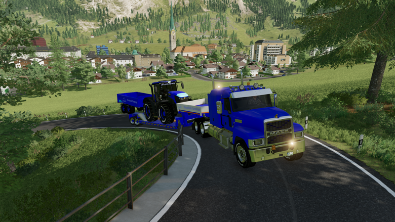

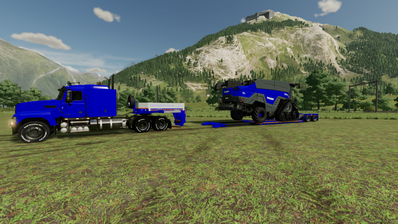

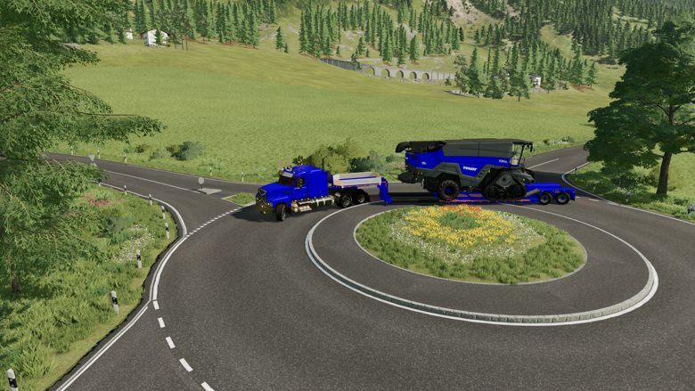

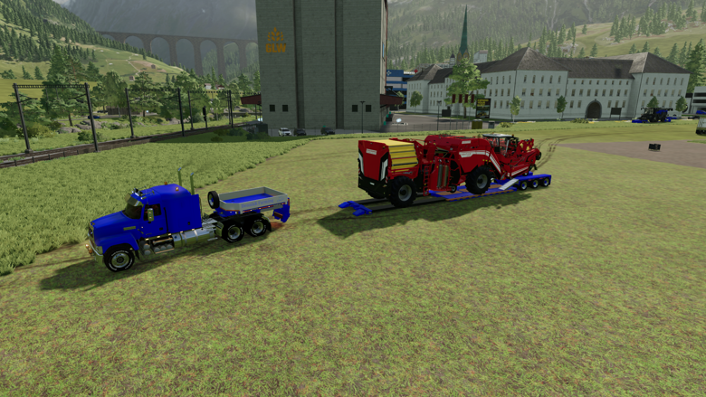

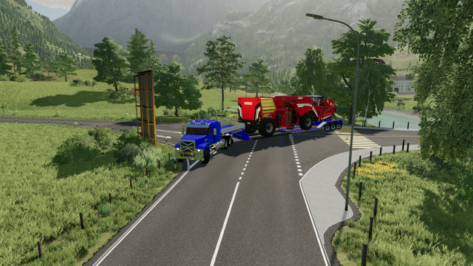

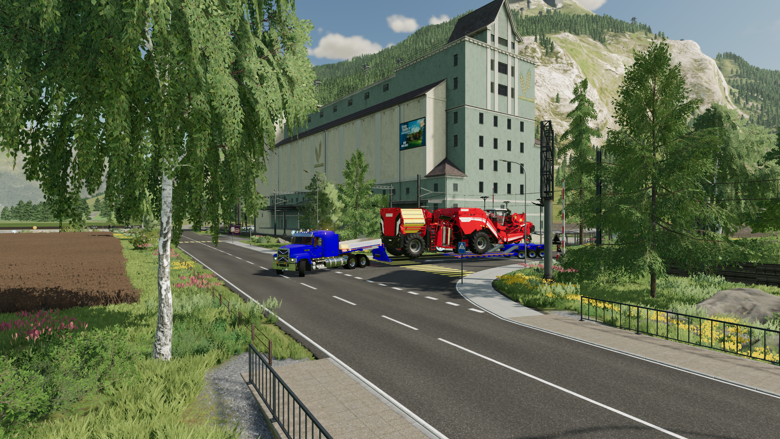

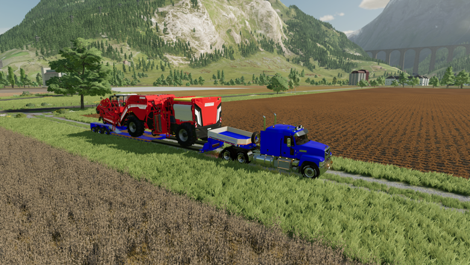


## Additional information

Since this is a redesigned mod there is no support for console.

If you discover any issues please submit them to the issues page.